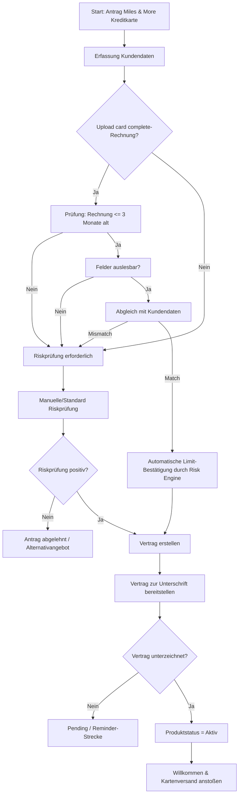

# Journey: Verkauf der Miles & More Kreditkarte

## Ziel
Diese Journey beschreibt den digitalen Verkaufsprozess für die **Miles & More Kreditkarte** mit optionalem Upload einer **card complete-Rechnung** (max. 3 Monate alt) zur vereinfachten Limit-Bestätigung.

## Prozessübersicht

## Detaillierte Schritte

1. **Antrag starten**
   - Einstieg in den Sales Funnel für die Miles & More Kreditkarte.
   - Einwilligungen und Pflichtinformationen anzeigen.

2. **Kundendaten erfassen**
   - Persönliche Daten, Kontakt, Identitäts- und Bonitäts-relevante Basisdaten.

3. **Optionaler Upload: card complete-Rechnung**
   - Kunde kann eine Rechnung hochladen, die nicht älter als 3 Monate ist.
   - Validierung des Rechnungsdatums erfolgt automatisch.

4. **Dokumentauslese & Datenabgleich**
   - OCR/Parsing liest relevante Felder (z. B. Name, Adresse, Produkt-/Kontobezug).
   - Wenn Felder auslesbar sind: Abgleich mit eingegebenen Kundendaten.

5. **Entscheidungslogik Riskprüfung**
   - **Pfad A (automatisiert):**
     - Rechnung gültig (<= 3 Monate), Felder auslesbar, Datenmatch.
     - Limit wird automatisch durch die Risk Engine bestätigt.
   - **Pfad B (Riskprüfung erforderlich):**
     - Kein Upload **oder** Rechnung zu alt **oder** Felder nicht auslesbar **oder** Datenabweichung.
     - Standard-/manuelle Riskprüfung als eigener Prozessschritt.

6. **Vertragserstellung**
   - Bei positiver Entscheidung (automatisch oder nach Riskprüfung) wird der Vertrag erzeugt.

7. **Digitale Unterzeichnung**
   - Vertrag wird zur Signatur bereitgestellt.
   - Nur bei erfolgreicher Signatur wird fortgesetzt.

8. **Produktaktivierung**
   - Nach unterzeichnetem Vertrag: Produktstatus auf **Aktiv** setzen.
   - Nachgelagerte Prozesse starten (Welcome-Kommunikation, Kartenproduktion/-versand).

## Business-Regeln (kompakt)

- **BR-01:** Eine card complete-Rechnung darf maximal 3 Monate alt sein.
- **BR-02:** Nur bei auslesbaren Feldern und vollständigem Kundendaten-Match ist eine automatische Limit-Bestätigung erlaubt.
- **BR-03:** Wenn BR-01 oder BR-02 nicht erfüllt sind, ist die Riskprüfung verpflichtend.
- **BR-04:** Ohne Vertragsunterzeichnung keine Aktivierung.
- **BR-05:** Bei unterschriebenem Vertrag wird das Produkt unmittelbar auf „Aktiv“ gesetzt.

## Statusmodell (vereinfacht)

- `APPLICATION_STARTED`
- `DATA_CAPTURED`
- `DOCUMENT_UPLOADED` (optional)
- `AUTO_LIMIT_CONFIRMED` **oder** `RISK_REVIEW_REQUIRED`
- `RISK_APPROVED` / `RISK_DECLINED`
- `CONTRACT_READY`
- `CONTRACT_SIGNED`
- `PRODUCT_ACTIVE`
